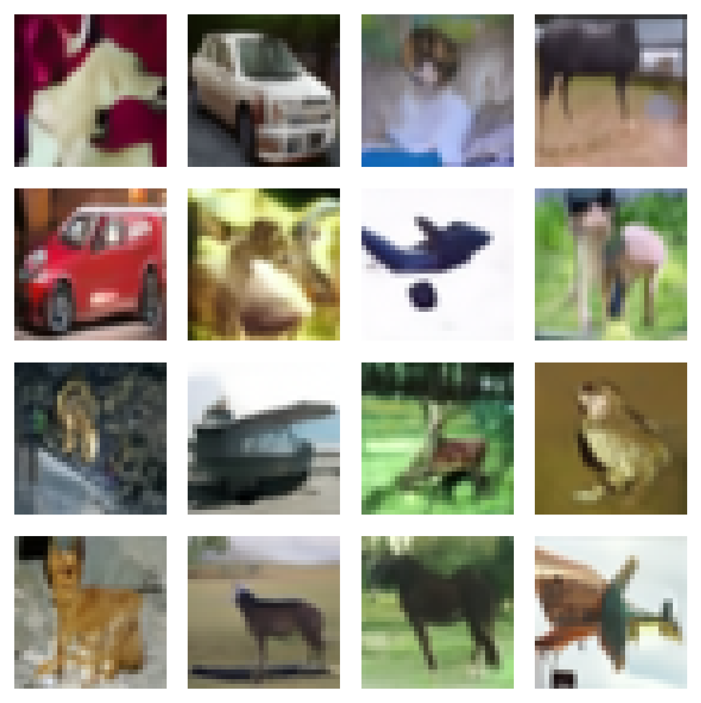
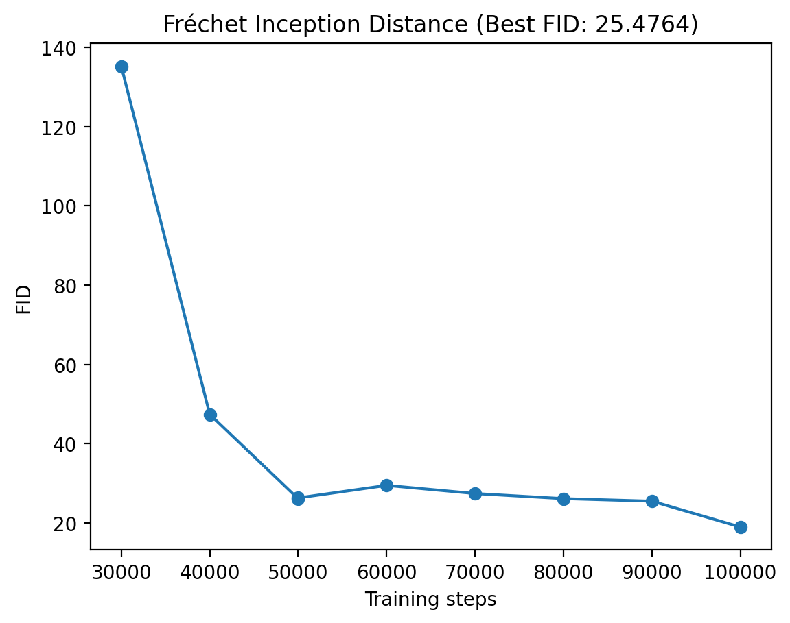

# Diffusion to Consistency

### DDPM baseline -> iterative modern upgrades -> Consistency Models (Maybe)

A small, readable diffusion repository that starts with a **vanilla DDPM-style ε-prediction model** and gradually moves toward more modern diffusion systems (score-based modeling, improved samplers, stability tricks, and eventually Stable-Diffusion-like components) **in small additive increments with minimal architectural disruption**.

This repo currently trains a **U-Net with timestep embeddings and selective self-attention** on **CIFAR-10 (32×32)**.


Core components include:

* CIFAR-10 dataloader with normalization to **[-1, 1]**
* U-Net backbone with ResBlocks, GroupNorm, timestep embeddings, and attention
* Sinusoidal timestep embedding utilities
* EMA model 
* Training script with checkpointing and loss visualization
* Fréchet Inception Distance (FID) calculation and reporting after every 10,000 training steps


---

## Why this repo exists

Most diffusion repositories jump directly into large frameworks, heavy abstractions, or latent diffusion pipelines. This repo is intentionally different:

* **Start minimal** (DDPM baseline)
* **Instrument heavily** (plots, sample grids, trajectories)
* **Add improvements iteratively** (one concept per PR)
* **Avoid architectural churn** (keep the U-Net interface stable)

If you want a *from-scratch but not toy* stepping stone toward modern diffusion systems, this repo is designed for that purpose.

---

## Current Implementation (Baseline)

### Data

* CIFAR-10 training set
* Random horizontal flip
* `ToTensor()` followed by `Normalize((0.5,…),(0.5,…))` → **[-1, 1]**

---

### Diffusion Process

* Linear beta schedule from `1e-4` to `0.02`
* Total timesteps: `T = 1000`
* Precomputed quantities:

  * `α_t = 1 − β_t`
  * `\bar{α}_t = ∏ α_t`

Training procedure:

* Sample `t ~ Uniform({0 … T−1})`
* Generate
  [
  x_t = \sqrt{\bar{\alpha}_t} x_0 + \sqrt{1 - \bar{\alpha}_t}\epsilon
  ]
* Predict ε with the U-Net
* Optimize mean-squared error loss

---

### Forward Diffusion Behavior

The figure below visualizes the forward diffusion process applied to the same CIFAR-10 images at increasing timesteps. As expected, structure is gradually destroyed as noise variance increases.


---

### Model: U-Net

* Encoder–decoder U-Net operating directly in pixel space
* ResBlocks consist of:

  * GroupNorm → SiLU → Conv
  * timestep embedding projection added to hidden activations
  * dropout + second conv with **zero initialization**
* Selective single-head self-attention at chosen resolutions (`attn_res`)
* Sinusoidal timestep embeddings followed by a 2-layer MLP
* Residual connections throughout (ResBlocks and Attention blocks)

The model interface is intentionally kept simple:

```
model(x_t, t) → ε̂
```

This allows objective and sampler upgrades without redesigning the backbone.

---
### EMA (Exponential Moving Average):

* A EMA of the model is kept and this is used for sampling. This gives more stable samples.

---

### Sampling

Standard ancestral DDPM reverse diffusion:

* Initialize `x_T ~ N(0, I)`
* Iterate `t = T−1 … 0`
* Compute DDPM posterior mean from ε-prediction
* Add noise at all steps except `t = 0`


DDIM (Denoising Diffusion Implicit Models) reverse diffusion:

- Initialize the sample with Gaussian noise:
  - `x_T ~ N(0, I)`
- Use a reduced set of timesteps sampled from the full diffusion chain.
- At each timestep:
  - Predict noise `ε̂ = ε_θ(x_t, t)`
  - Estimate the clean image `x̂_0`
  - Update the sample deterministically (η = 0) or stochastically (η > 0)
- No noise is added when `η = 0`, resulting in deterministic sampling.

**Notes**
- `η = 0` → deterministic DDIM (fast, non-ancestral)
- `η > 0` → stochastic DDIM (interpolates toward DDPM)
- Same training objective as DDPM

Returns the final denoised sample `x_0`.

---

### Generated Samples

Below are samples generated via ancestral DDPM sampling from pure noise using the current baseline configuration.

#### warm-up training (~5k steps)

<!--  -->


#### FID stabilizes (~50k steps, FID ~ 25)
<!--  -->

---

### Training Dynamics

<!--  -->


The training loss decreases steadily, indicating stable ε-prediction optimization under the linear noise schedule.

<!--  -->


The FID score progression over training steps. Lowest FID ~20 after 100,000 steps.

---

## Repository Structure

* `datasetLoaders.py` — CIFAR-10 dataloader and preprocessing
* `diffusion.py` — schedules, forward diffusion, training step, samplers (Ancestral and DDIM)
* `models.py` — U-Net, ResBlocks, attention, up/downsampling blocks
* `utils.py` — timestep embeddings, sample saving, visualization helpers
* `scripts.py` — training entry point, checkpointing, loss plotting, evaluation helpers
* `ema.py` — EMA class and Helpers
* `train_cifar.py` — Train script for CIFAR 10 dataset, implements checkpointing, FID tracking, and EMA model.

---

## Quickstart

### 1) Install dependencies

```bash
pip install uv
# Go to project root and then
uv sync
```

---

### 2) Train

```bash
python train_cifar.py
```

This will:

* download CIFAR-10 into `./data`
* train indefinitely
* save checkpoints to `working/<exp_no>/checkpoints` once every 10,000 train steps or till you quit
* write a training loss plot and FID plot to  `working/<exp_no>/saves` once every 10,000 train steps


---

### Checkpoints

Saved at:

```
<exp_no>/heckpoints/
```

Each checkpoint contains:

* `step`
* model `state_dict`
* ema   `state_dict`
* optimizer `state_dict`
* loss history
* FID history
* best FID

---

## Iterative Upgrade Path

The guiding principle is to keep `model(x_t, t)` stable and make most upgrades modular.

### Phase 1: DDPM baseline hardening (COMPLETED)

* Exponential moving average (EMA) of model weights
* Improved logging (CSV / JSON)
* Deterministic seeding and reproducibility
* Periodic sample grids during training

### Phase 2: Objective variants

* v-prediction (Stable Diffusion style)
* x₀-prediction
* SNR-weighted losses

All introduced without redesigning the U-Net.

### Phase 3: Score-based modeling

* Interpret outputs as score estimates
* Introduce continuous-time (VE / VP SDE) formulations incrementally

### Phase 4: Better samplers

* DDIM
* Predictor–corrector methods
* DPM-Solver-style samplers

### Phase 5: Toward Stable Diffusion

* Classifier-free guidance
* Conditioning pathways (class → later text)
* Latent diffusion via an auxiliary autoencoder

---

## Contributing / Collaboration

Contributions are welcome.

### What fits well

* Small, focused PRs (one concept at a time)
* Clear validation plots or metrics
* Minimal changes to `models.py` unless necessary

### Good starter contributions

* EMA weights + EMA sampling (COMPLETED)
* Sample grid saving during training (COMPLETED)
* Resume-from-checkpoint support (COMPLETED)
* DDIM sampler (COMPLETED)
* Metrics logging utilities (FID ADDED)

Open an issue first if you’re unsure — happy to discuss direction.


---

## Acknowledgements

Design choices follow common DDPM and U-Net best practices: timestep embeddings, residual blocks with GroupNorm, selective attention, and ancestral sampling.

The goal is not novelty, but **clarity, correctness, and extensibility**.

